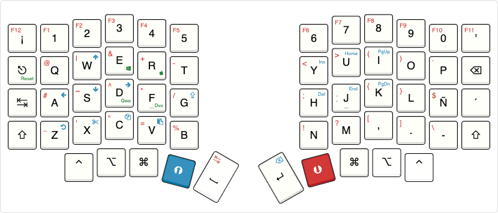

# Fritz's custom keyboard configuration

## About

I'm currently using a [sofle keyboard](https://github.com/josefadamcik/SofleKeyboard) with Outemu Brown switches and standard oem keycaps.

This whole layout is intended to be used with a spanish layout configured on the OS. It has four different layers:

-   Base: mainly alphabetic characters and number
-   Upper: non-alphabetical symbols
-   Lower: keys with binding commands, such as arrows, copy, paste, delete or caps lock
-   Adjust: change the configuration of the keyboard.

## Layout

The layout can be found in [Keyboard Layout Editor](https://www.keyboard-layout-editor.com/#/gists/03e9cedcaee870a5ef1d812f749277d3)



```
/* Base
 * ,-----------------------------------.             ,-----------------------------------.
 * |  ¡  |  1  |  2  |  3  |  4  |  5  |             |  6  |  7  |  8  |  9  |  0  |  '  |
 * |-----+-----+-----+-----+-----+-----|             |-----+-----+-----+-----+-----+-----|
 * | esc |  q  |  w  |  e  |  r  |  t  |             |  y  |  u  |  i  |  o  |  p  | bsp |
 * |-----+-----+-----+-----+-----+-----|             |-----+-----+-----+-----+-----+-----|
 * | tab |  a  |  s  |  d  |  f  |  g  |             |  h  |  j  |  k  |  l  |  ñ  |  ´  |
 * |-----+-----+-----+-----+-----+-----|             |-----+-----+-----+-----+-----+-----|
 * | sft |  z  |  x  |  c  |  v  |  b  |-----. ,-----|  n  |  m  |  ,  |  .  |  -  | sft |
 * `-----------+-----+-----+-----+-----| Spc | | Ent |-----+-----+-----+-----------------'
 *             | gui | alt | ctr | UPP |     | |     | LOW | ctr | alt | gui |
 *             `-----+-----|-----+-----'-----' `-----+-----+-----+-----+-----'
 */

/* Lower
 * ,-----------------------------------.             ,-----------------------------------.
 * | F12 | F1  | F2  | F3  | F4  | F5  |             | F6  | F7  | F8  | F9  | F10 | F11 |
 * |-----+-----+-----+-----+-----+-----|             |-----+-----+-----+-----+-----+-----|
 * | esc |  @  |  |  |  &  |  +  |  -  |             |  <  |  >  |  (  |  )  |  `  | bsp |
 * |-----+-----+-----+-----+-----+-----|             |-----+-----+-----+-----+-----+-----|
 * | tab |  #  |  ~  |  ^  |  *  |  /  |             |  ;  |  :  |  {  |  }  |  $  |     |
 * |-----+-----+-----+-----+-----+-----|             |-----+-----+-----+-----+-----+-----|
 * | sft |  _  |  '  |  "  |  =  |  %  |-----. ,-----|  !  |  ?  |  [  |  ]  |  \  | sft |
 * `-----------+-----+-----+-----+-----| Tab | | Ent |-----+-----+-----+-----------------'
 *             | gui | alt | ctr | ADJ |     | |     |PRESS| ctr | alt | gui |
 *             `-----+-----|-----+-----'-----' `-----+-----+-----+-----+-----'
 */

/* Upper
 * ,-----------------------------------.             ,-----------------------------------.
 * |     |     |     |     |     |     |             | psc | slk | pau |     |     |     |
 * |-----+-----+-----+-----+-----+-----|             |-----+-----+-----+-----+-----+-----|
 * | esc |     |  ↑  |     |     |     |             | ins | hom | pg↑ |     |     | bsp |
 * |-----+-----+-----+-----+-----+-----|             |-----+-----+-----+-----+-----+-----|
 * | tab |  ←  |  ↓  |  →  |     | clk |             | del | end | pg↓ |     |     |     |
 * |-----+-----+-----+-----+-----+-----|             |-----+-----+-----+-----+-----+-----|
 * | sft | cut | cpy | pas |     |     |-----. ,-----|     |     |     |     |     | sft |
 * `-----------+-----+-----+-----+-----| Spc | | Bsp |-----+-----+-----+-----------------'
 *             | gui | alt | ctr |PRESS|     | |     | ADJ | ctr | alt | gui |
 *             `-----+-----|-----+-----'-----' `-----+-----+-----+-----+-----'
 */

/* Adj
 * ,-----------------------------------.             ,-----------------------------------.
 * |     |     |     |     |     |     |             |     |     |     |     |     |     |
 * |-----+-----+-----+-----+-----+-----|             |-----+-----+-----+-----+-----+-----|
 * | RES |     | QWE | DVO |     |     |             |     |     |     |     |     |     |
 * |-----+-----+-----+-----+-----+-----|             |-----+-----+-----+-----+-----+-----|
 * |     |     | ⇆⊞ |     |     |     |             |     | vo↓ | mut | vo↑ |     |     |
 * |-----+-----+-----+-----+-----+-----|             |-----+-----+-----+-----+-----+-----|
 * |     |     |     |     |     |     |-----. ,-----|     | pre | pla | nex |     |     |
 * `-----------+-----+-----+-----+-----| Spc | | Bsp |-----+-----+-----+-----------------'
 *             | gui | alt | ctr |PRESS|     | |     |PRESS| ctr | alt | gui |
 *             `-----+-----|-----+-----'-----' `-----+-----+-----+-----+-----'
 */

```

## Features

### Smart tab and smart backspace

When switching to lower or upper layers, the space and the enter keys turns into tab and backspace keys, respectively.

### Encoders

Sofle keyboard provides two encoders. The left one is configured to mute and change the volume. The right can scroll up or down.

### Windows / Mac usage

With the Adjust layer, you can configure the usage for windows or mac, switching the control with the command key.

### Luna, the keyboard pet

Features:

-   Luna reacts to your wpm counter
    -   under 10 wpm she sits
    -   between 10 and 40 wpm she walks
    -   over 40 wpm she runs
-   She will move sneakily if you hold down Ctrl
-   Will bark at people on the internet if you activate Caps Lock!
-   Luna jumps every time you hit Space

Watch a demo video here:
https://www.youtube.com/watch?v=HgIQRazCAjo
